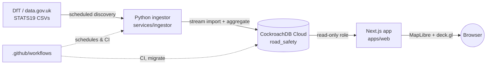

# RoadSafe UK

RoadSafe UK is a map-based analysis tool for police-reported personal-injury
road collisions in Great Britain, built on the Department for Transport's
STATS19 open dataset. It's a full-stack portfolio project: a Next.js web
application, a CockroachDB Cloud database, and a Python ingestion service
that discovers, downloads, and loads the DfT's published data on a schedule.

Live at: not yet deployed. See [`PROJECT_STATUS.md`](PROJECT_STATUS.md) for
current build status.

## What it does

- A national dashboard of collision and casualty trends by year and severity.
- An interactive map (MapLibre GL JS + deck.gl) that switches between
  heatmap, H3 hexagon, cluster, and individual-collision layers depending on
  zoom level, with filters for severity, road user type, and more.
- A local authority explorer with per-area trends and population-normalised
  rates, always shown with their denominator.
- A road user breakdown (pedestrians, cyclists, motorcyclists, car
  occupants, and more) and a hotspots page with separately labelled
  rankings, deliberately never a single blended "danger score".
- Full data provenance: an "about the data" page describing the source,
  licence, and methodology, and a status page showing ingestion run history.

## Why STATS19

STATS19 is the UK's official police-reported road collision dataset,
published by the Department for Transport under the Open Government
Licence. It records every collision resulting in personal injury, along
with details of the vehicles and casualties involved, coded rather than
free text. See [`docs/data-sources.md`](docs/data-sources.md) for licensing
and update cadence, and [`docs/methodology.md`](docs/methodology.md) for
what the coded fields mean and where the analysis deliberately does not go
further than the data supports.

## Architecture



The three deployable pieces are:

- **`apps/web`**: Next.js 16 App Router application (React 19, TypeScript,
  Tailwind v4, shadcn/ui). Server components query the database directly
  through Prisma; a small set of `/api/map/*` routes serve the interactive
  map's H3, cluster, and raw-point queries. Deployed on Vercel.
- **`services/ingestor`**: a Python service that discovers newly published
  STATS19 files, streams them into CockroachDB, computes precomputed H3 and
  annual aggregates, and verifies row counts reconcile before marking a run
  successful. Runs on a schedule via GitHub Actions, not as a long-lived
  server.
- **CockroachDB Cloud** (`road_safety` database, cluster `silent-jindo`):
  the single source of truth, accessed through three least-privilege roles
  (`roadsafe_app` read-only, `roadsafe_ingestor` read/write on data tables,
  `roadsafe_migrator` schema owner).

See [`docs/architecture.md`](docs/architecture.md) for the full breakdown,
[`docs/database.md`](docs/database.md) for the schema, and
[`docs/map-architecture.md`](docs/map-architecture.md) for how the map
picks its data source per zoom level.

## Monorepo layout

```
apps/web              Next.js application (deployed to Vercel)
packages/database      Prisma schema, generated client, migrations
packages/shared        Zod schemas, STATS19 code mappings, shared constants
services/ingestor      Python ingestion pipeline (deployed via GitHub Actions)
config/                 Source discovery config, code lists, metric definitions
docs/                   Architecture, database, deployment, and operations docs
.github/workflows/      CI, scheduled ingestion, aggregate rebuilds, migrations
```

pnpm workspaces tie `apps/web`, `packages/database`, and `packages/shared`
together; `services/ingestor` is a separate Python package with its own
dependency management (uv/pip via `pyproject.toml`).

## Getting started

Requires Node.js 22+, pnpm 9+, Python 3.12+, and a CockroachDB connection
(either CockroachDB Cloud or the local `docker-compose.yml` instance for
schema work without live data).

```bash
pnpm install
cp .env.example apps/web/.env.local     # fill in real values, never commit
cp .env.example packages/database/.env
cp .env.example services/ingestor/.env
pnpm db:generate
pnpm dev
```

See [`docs/deployment.md`](docs/deployment.md) for CockroachDB Cloud setup,
Vercel linking, and the production deploy sequence, and
[`docs/ingestion.md`](docs/ingestion.md) for running the ingestor locally.

## Testing

```bash
pnpm -r typecheck && pnpm lint && pnpm build   # apps/web, packages/database, packages/shared
pnpm test                                       # Vitest across all TS packages
pnpm test:e2e                                   # Playwright, against a live dev server
cd services/ingestor && pytest && ruff check . && ruff format --check . && mypy src
```

## Documentation

- [`docs/architecture.md`](docs/architecture.md): system components and how
  they fit together.
- [`docs/database.md`](docs/database.md): schema, indexes, and referential
  integrity.
- [`docs/data-sources.md`](docs/data-sources.md): STATS19 provenance,
  licence, and update cadence.
- [`docs/ingestion.md`](docs/ingestion.md): the ingestion pipeline, its CLI
  commands, and how the scheduled workflow drives them.
- [`docs/map-architecture.md`](docs/map-architecture.md): the interactive
  map's rendering and zoom-dependent query strategy.
- [`docs/methodology.md`](docs/methodology.md): definitions behind every
  derived metric and grouping (KSI, road user groups, rates).
- [`docs/deployment.md`](docs/deployment.md): CockroachDB Cloud, Vercel, and
  GitHub Actions setup, in order.
- [`docs/operations.md`](docs/operations.md): running and monitoring
  scheduled jobs, responding to a failed ingestion run.
- [`docs/privacy.md`](docs/privacy.md): what personal data STATS19 contains
  and how this project handles it.
- [`docs/troubleshooting.md`](docs/troubleshooting.md): CockroachDB and
  Prisma quirks encountered while building this, and their fixes.

## License and data attribution

Application code: see [`LICENSE`](LICENSE) if present, otherwise treat as
all rights reserved by the author. Underlying STATS19 data is Crown
copyright, contains public sector information licensed under the
[Open Government Licence v3.0](https://www.nationalarchives.gov.uk/doc/open-government-licence/version/3/),
courtesy of the Department for Transport. Map tiles are provided by
[OpenFreeMap](https://openfreemap.org), built from
[OpenStreetMap](https://www.openstreetmap.org/copyright) data.
