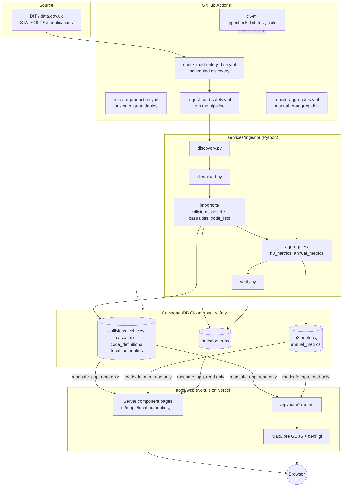

# Architecture

## Components

## Why this shape

STATS19 data is published by the DfT on an irregular schedule (final data
once a year, provisional mid-year data more often), not something a web app
should fetch and process on every request. Splitting ingestion out as a
separate, schedule-driven service rather than a background job inside the
Next.js app keeps the web app's only job as "render what's already in the
database", which is what makes its pages cheap to serve and safe to cache.

The web app never gets write access to the database. `roadsafe_app` is a
read-only Postgres role; even a full request-smuggling or injection bug in
`apps/web` cannot modify data, because CockroachDB itself refuses the write
at the connection level, not because application code checks anything. This
was verified directly during the CockroachDB bootstrap (see
[`troubleshooting.md`](troubleshooting.md)) with a real blocked `INSERT`.

## apps/web

Next.js 16, App Router, React 19 Server Components by default. Data-heavy
pages (`/`, `/local-authorities`, `/local-authorities/[code]`,
`/road-users`, `/hotspots`, `/collisions/[collisionIndex]`, `/status`) query
Prisma directly in the server component and are revalidated on a fixed
interval (`export const revalidate = 3600`, or `300` on `/status`), not
rendered on every request and not frozen at build time either. `/about/data`
has no data dependency and is fully static.

The `/map` page is the one genuinely interactive surface: a client
component (`components/map/map-view.tsx`) driving MapLibre GL JS (basemap)
and deck.gl (data layers), fetching from six `/api/map/*` routes that all
share one SQL filter-condition builder
(`apps/web/lib/api/collision-filters.ts`) so filter semantics cannot drift
between endpoints. See [`map-architecture.md`](map-architecture.md) for how
it decides which of those routes to call at a given zoom level.

`packages/shared` holds everything that must stay identical between the
`/api/map/*` route handlers and the client code calling them: the Zod
schemas for query parameters, the STATS19 severity/age-band/road-user code
mappings, and the zoom-to-resolution strategy. `packages/database` holds
the Prisma schema, the generated client, and migrations; it exports a
singleton `PrismaClient` so serverless function invocations reuse
connections rather than opening a new one per request.

## services/ingestor

A Typer CLI (`ingestor <command>`), not a server. Its full pipeline
(`ingestor run <year>`) is: discover the year's published files, stream
each CSV into the corresponding table with `psycopg`, build H3 aggregates
at three resolutions, build annual metrics, run verification checks that
compare row counts and totals between raw tables and aggregates, and only
mark the `IngestionRun` row `SUCCEEDED` if every check passes. See
[`ingestion.md`](ingestion.md) for the full command reference and
[`operations.md`](operations.md) for how the scheduled workflow drives it
and what to do when a run fails.

It connects as `roadsafe_ingestor`, a role with `SELECT`/`INSERT`/`UPDATE`/
`DELETE` on data tables but no `DROP`, `ALTER`, or `CREATE` privileges;
schema changes are exclusively the job of `roadsafe_migrator`, run only
through `prisma migrate deploy` in CI, never by the ingestor.

## Database

CockroachDB Cloud, chosen for its Postgres wire compatibility (so Prisma
and `psycopg` both work unmodified) and managed multi-node resilience
without operating Postgres replication by hand. See
[`database.md`](database.md) for the schema and
[`troubleshooting.md`](troubleshooting.md) for the CockroachDB-specific
quirks (region auto-assignment, `schema_locked` defaults, shadow database
requirements) that came up getting Prisma migrations working against it.

## CI/CD

Five GitHub Actions workflows, described in full in
[`operations.md`](operations.md):

- `ci.yml`: typecheck, lint, test, and build every push/PR across the whole
  monorepo (`apps/web`, `packages/database`, `packages/shared`, and
  `services/ingestor`'s pytest/ruff/mypy).
- `check-road-safety-data.yml`: scheduled discovery only, opens an issue
  when a new DfT publication is found rather than importing automatically.
- `ingest-road-safety.yml`: runs the ingestion pipeline for a given year,
  gated by the `INGESTION_ENABLED` and `PROVISIONAL_DATA_ENABLED`
  repository variables.
- `rebuild-aggregates.yml`: manually triggered re-aggregation, for when
  `packages/shared`'s grouping logic changes and historic aggregates need
  recomputing without a full re-import.
- `migrate-production.yml`: applies pending Prisma migrations to the
  production database using the `roadsafe_migrator` role, kept entirely
  separate from the app and ingestor's credentials.
