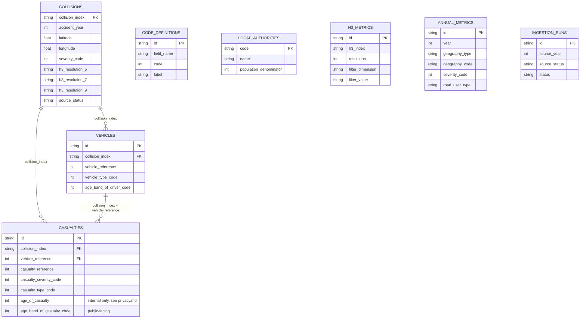

# Database

CockroachDB Cloud, database `road_safety`, cluster `silent-jindo`. Schema
is owned by Prisma (`packages/database/prisma/schema.prisma`); this
document explains the shape and the reasoning behind it, not just a copy of
the schema itself.

## Entity relationships

## Core tables

`collisions`, `vehicles`, and `casualties` mirror STATS19's own three-file
structure (one collision record, N vehicle records, N casualty records per
collision), joined on `collision_index` (STATS19's `accident_index`).
`casualties` additionally references `vehicles` on the composite key
`(collision_index, vehicle_reference)`, matching how STATS19 links a
casualty to the specific vehicle they were in or hit by.

Every foreign key cascades on delete: removing a `Collision` removes its
`Vehicle` and `Casualty` rows automatically at the database level, not via
application code. This is enforced by CockroachDB itself
(`ON DELETE CASCADE`), and was directly verified with a real insert/delete
test after a genuine bug (see [`troubleshooting.md`](troubleshooting.md))
was found where these constraints had silently never been applied.

Every coded field (severity, road type, weather, vehicle type, and so on)
is stored as its raw STATS19 integer code, not a decoded label. Labels live
in `code_definitions`, versioned by `valid_from_year`/`valid_to_year`
because the DfT has changed some code meanings across years of guidance
documents; decoding always happens at query/render time, never by
duplicating label strings onto every row. `packages/shared` additionally
hardcodes the groupings (KSI, road user type, age bands) that the
application's filters and pages need to reason about in TypeScript without
a database round trip, kept in sync by hand with `code_definitions` and
with the ingestor's Python equivalents, since there are three separate
runtimes involved (Prisma/TypeScript, raw SQL, and Python).

## Privacy-sensitive fields

`casualties.age_of_casualty` (and the equivalent field on vehicles for
drivers) stores the exact STATS19 age, retained only because it's needed
to compute one internal aggregate (young-driver involvement uses the exact
age band boundary rather than a rounded one). No public-facing query,
route, or page is allowed to select it; every UI surface uses
`age_band_of_casualty_code` / `age_band_of_driver_code` instead. See
[`privacy.md`](privacy.md) for the full policy and where this is enforced
in code.

## Precomputed aggregates

`h3_metrics` and `annual_metrics` exist because the map and dashboard
pages need to answer "how many collisions of type X in region Y" fast, at
national scale, without scanning millions of raw rows per request.

- `h3_metrics` stores one row per (H3 cell, resolution, period,
  filter dimension, filter value) combination, for a fixed set of
  high-value dimensions (severity, road user type). Zoom levels
  8 and below in the map UI read this table instead of aggregating raw
  points live; uncommon filter combinations that aren't precomputed here
  fall back to a live query against `collisions`, which is only fast
  because of the `h3_resolution_5`/`_7`/`_9` indexed columns.
- `annual_metrics` backs the dashboard and local authority explorer: one
  row per (year, geography, severity, road user type, ...) slice, so
  `/`, `/local-authorities/[code]`, and `/road-users` never scan
  `collisions` directly.

Both tables carry `source_import_id`, tying every aggregate row back to the
`ingestion_runs` row that produced it, so a bad import's aggregates can be
identified and rebuilt (`rebuild-aggregates.yml`) without guesswork.

## Operational tracking

`ingestion_runs` records one row per pipeline execution: which year and
source status it targeted, how many rows it saw/inserted/rejected, whether
verification passed, and (when it fails) an error summary. The `/status`
page reads this table directly. This is what makes ingestion auditable:
"why does the dashboard show X" always has an answer traceable to a
specific run.

## Roles and privileges

Three roles, least privilege enforced at the database level rather than
only in application code:

| Role | Used by | Privileges |
|---|---|---|
| `roadsafe_app` | `apps/web` | `SELECT` only, on every table |
| `roadsafe_ingestor` | `services/ingestor` | `SELECT`, `INSERT`, `UPDATE`, `DELETE` on data/aggregate/run tables, no DDL |
| `roadsafe_migrator` | `prisma migrate deploy` in CI | Schema owner: `CREATE`, `ALTER`, `DROP` |

`ALTER DEFAULT PRIVILEGES FOR ROLE roadsafe_migrator` was used when setting
these up, so that tables created by future migrations automatically grant
the right access to the other two roles without a manual `GRANT` step
being remembered (or forgotten) per migration.

## Migrations

Prisma migrations, applied with `prisma migrate deploy` (never
`migrate dev` against production). The initial migration
(`20260801190432_init`) was generated with
`prisma migrate diff --from-empty --to-schema-datamodel` and applied by
hand during the CockroachDB bootstrap, then baselined with
`prisma migrate resolve --applied` so Prisma's own migration history table
matches what's actually in the database. See
[`troubleshooting.md`](troubleshooting.md) for the CockroachDB-specific
issues that came up doing this (region auto-assignment, the
`schema_locked` default blocking follow-up `ALTER TABLE` statements, and
the missing-foreign-key bug this baselining approach caused once).

Going forward, schema changes should go through `prisma migrate dev`
locally against the shadow database (`SHADOW_DATABASE_URL` in
`packages/database/.env`), then be applied to production exclusively by
the `migrate-production.yml` workflow using the `roadsafe_migrator`
credential, never applied by hand again.
