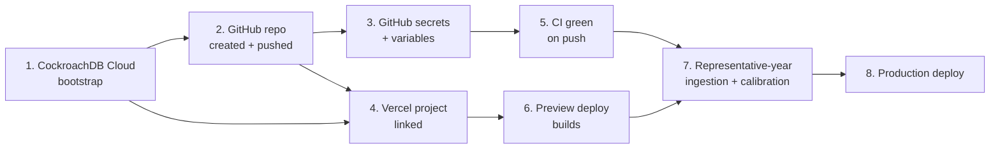

# Deployment

This is the order dependencies actually resolve in, not an arbitrary
checklist. Each step genuinely blocks the next.



## 1. CockroachDB Cloud

Already complete for this project (cluster `silent-jindo`, database
`road_safety`). For a fresh setup: create the cluster, create the target
database, immediately drop its auto-assigned region
(`ALTER DATABASE <name> DROP REGION <region>`, see
[`troubleshooting.md`](troubleshooting.md)), create the three least
privilege roles described in [`database.md`](database.md), then run
`prisma migrate deploy` (or, for a first-time bootstrap, generate and
apply a baseline migration as described there).

Connection strings for each role go into three separate gitignored `.env`
files, never one shared file: `apps/web/.env.local` (`roadsafe_app`),
`packages/database/.env` (`roadsafe_migrator`, plus a
`SHADOW_DATABASE_URL` for local `migrate dev`), `services/ingestor/.env`
(`roadsafe_ingestor`). The cluster admin/bootstrap credential itself is
never stored anywhere beyond the one-time bootstrap step; see
[`operations.md`](operations.md) for the handling rule.

## 2. GitHub repository

```bash
git add -A
git commit -m "..."
gh repo create roadsafe-uk --private --source=. --push
```

Confirm visibility (private vs. public) before running this, it's a
one-way decision to make deliberately rather than default through.

## 3. GitHub secrets and repository variables

Set on the repository (Settings > Secrets and variables > Actions), used
by the workflows in [`operations.md`](operations.md):

| Name | Type | Value |
|---|---|---|
| `INGEST_DATABASE_URL` | Secret | `roadsafe_ingestor`'s connection string |
| `MIGRATION_DATABASE_URL` | Secret | `roadsafe_migrator`'s connection string |
| `INGESTION_ENABLED` | Variable | `true` / `false`, master switch for `ingest-road-safety.yml` |
| `PROVISIONAL_DATA_ENABLED` | Variable | `true` / `false`, whether scheduled ingestion may import provisional (not just final) data |

Never store `DATABASE_URL` (the read-only app role) as a GitHub secret,
it's not needed by any workflow, only by the deployed app itself via
Vercel's environment variables.

## 4. Vercel

Link `apps/web` as the project root (not the repo root, this is a
monorepo). Environment variables to set, matching
`apps/web/.env.local`'s keys: `DATABASE_URL` (`roadsafe_app`),
`NEXT_PUBLIC_SITE_URL`, `NEXT_PUBLIC_MAP_STYLE_URL`,
`NEXT_PUBLIC_MAP_ATTRIBUTION`, `NEXT_PUBLIC_DEFAULT_MAP_LATITUDE`,
`NEXT_PUBLIC_DEFAULT_MAP_LONGITUDE`, `NEXT_PUBLIC_DEFAULT_MAP_ZOOM`, and
the server-only `MAP_RAW_POINT_LIMIT`/`MAP_MAX_BOUNDING_BOX_AREA`. Confirm
a preview deployment actually builds and the map/dashboard render (even
against an empty database, they have defined empty states, see
[`PROJECT_STATUS.md`](../PROJECT_STATUS.md)) before treating this step as
done.

## 5. CI

`ci.yml` should go green on the first push once the repo exists; it has
already been run locally (`pnpm -r typecheck && pnpm lint && pnpm build`,
`pytest`/`ruff`/`mypy` for the ingestor) but not yet inside GitHub Actions
itself, worth confirming rather than assuming parity.

## 6. Representative-year ingestion and calibration

Run the ingestor against production for a single, recent, final year
first (see [`ingestion.md`](ingestion.md)), confirm `ingestor verify`
passes and the deployed app's pages render correctly against real data,
and write up a short calibration report (row counts, any rejected rows and
why, spot-checked figures against the DfT's own published summary
statistics for that year). **A full five-year import requires explicit
user approval after that report is reviewed**, it does not happen as part
of routine deployment.

## 7. Production deploy

Promote the Vercel preview to production once the calibration import is
approved and verified, then walk the full acceptance checklist (spec
section 23) against the live system: every page loads, every filter
works, provenance/methodology pages are accurate, no console errors, no
exposed credentials in any client bundle or response.

## Rollback

Vercel: promote a previous deployment from the dashboard or
`vercel rollback`. Database: `prisma migrate deploy` is forward-only by
design in this project (no down migrations are authored); a schema
rollback means writing and reviewing a new forward migration that reverts
the change, not running an autogenerated down migration blind against
production data.
