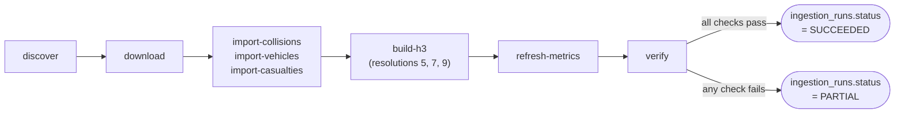

# Ingestion pipeline

`services/ingestor` is a Typer CLI (entry point `ingestor`, defined in
`services/ingestor/src/roadsafe_ingestor/cli.py`), not a long-running
server. It's invoked on a schedule by
[`.github/workflows/ingest-road-safety.yml`](../.github/workflows/ingest-road-safety.yml)
(see [`operations.md`](operations.md) for the workflow itself), and can
also be run locally for development and calibration.

## Pipeline stages



`ingestor run <year>` chains import, aggregate, and verify into a single
command backed by one `IngestionRun` row, catching any exception and
marking the run `FAILED` with the exception message (truncated to 4000
characters) rather than leaving a run stuck in `RUNNING` forever.

## Commands

All commands read connection and behaviour settings from environment
variables (`services/ingestor/.env` locally, GitHub Actions secrets/
variables in CI); see [`.env.example`](../.env.example).

| Command | What it does |
|---|---|
| `ingestor discover` | Fetches the DfT catalog and CKAN API, prints which years are available as final vs. provisional. Read-only, makes no database connection. |
| `ingestor download [--data-dir]` | Downloads the currently discovered resources to disk. |
| `ingestor import-code-lists` | Loads `config/stats19-code-lists/code-lists.json` into `code_definitions`. Run once, or after the code list config changes. |
| `ingestor import-collisions <csv> [--source-status] [--source-revision]` | Streams a collision CSV into `collisions`. Prints seen/inserted/rejected counts. |
| `ingestor import-vehicles <csv>` | Streams a vehicle CSV into `vehicles`. |
| `ingestor import-casualties <csv>` | Streams a casualty CSV into `casualties`. |
| `ingestor build-h3 <year> [--source-import-id]` | Builds `h3_metrics` rows at resolutions 5, 7, and 9 for the given year, then runs `verify_h3_totals` and warns (does not fail) if a resolution doesn't reconcile. |
| `ingestor refresh-metrics <year> [--source-import-id]` | Rebuilds `annual_metrics` rows for the given year: national totals, national by severity, national by road user type, and the equivalent local-authority-dimensioned rows. |
| `ingestor verify <year>` | Runs post-import verification checks and exits non-zero if any fail; used standalone or as part of `run`. |
| `ingestor cleanup [--data-dir]` | Deletes downloaded source files (CI should not retain multi-hundred-megabyte CSVs as artifacts). |
| `ingestor run <year> [options]` | The full pipeline: import (given explicit CSV paths), aggregate, verify, all under one `IngestionRun` row. Supports `--dry-run`, `--skip-vehicles`, `--skip-casualties`, `--skip-aggregates`. |

Streaming import (via `polars` for CSV parsing and `psycopg` for batched
inserts) means memory use stays flat regardless of file size; a full year
of UK collision data is well within what this approach handles comfortably
on a GitHub Actions runner.

## Coordinate and index enrichment

STATS19 publishes locations as OSGR eastings/northings
(`location_easting_osgr`/`location_northing_osgr`), the historical UK
mapping grid, not latitude/longitude. `coordinates.py` converts every row
to WGS84 lat/lon (via `pyproj`) at import time, and `h3_utils.py` computes
H3 cell indexes at resolutions 5, 7, and 9 from that lat/lon (via `h3-js`'s
Python equivalent, the `h3` package), storing them directly on the
`collisions` row (`h3_resolution_5`/`_7`/`_9` columns) so the map's H3
queries never need to compute a cell index at query time, only filter on
an indexed column.

## Verification

`verify.py` runs a set of named checks after import/aggregation and
reports each as PASS/FAIL with a human-readable detail string, for example
reconciling `annual_metrics` national totals against a direct `COUNT(*)`
over `collisions` for the same year, and reconciling `h3_metrics` totals
per resolution against the same. A run is only marked `SUCCEEDED` if every
check passes; if any fail, it's marked `PARTIAL` and the workflow run
fails loudly rather than the dashboard silently showing under- or
over-counted data.

## Running locally

```bash
cd services/ingestor
uv sync  # or: pip install -e ".[dev]"
cp ../../.env.example .env   # fill in INGEST_DATABASE_URL for your target database
ingestor discover
ingestor download --data-dir data/raw
ingestor import-code-lists
ingestor run 2023 \
  --collisions-csv data/raw/collisions.csv \
  --vehicles-csv data/raw/vehicles.csv \
  --casualties-csv data/raw/casualties.csv \
  --source-revision 2023-release-1
```

`download_resource()` names each file after its `DatasetKind` value
(`collisions.csv`, `vehicles.csv`, `casualties.csv`, `code_list.csv`), not
per year, since a single downloaded file from the DfT catalog can span
multiple years; `--collisions-csv` etc. always point at these fixed
filenames regardless of which year is passed to `run`.

Or against the local `docker-compose.yml` CockroachDB instance instead of
CockroachDB Cloud, for schema-only work without touching production data.

## Calibration import

Before any full five-year import, the plan (see
[`PROJECT_STATUS.md`](../PROJECT_STATUS.md)) is to import a single
representative final year first, confirm `ingestor verify` passes and the
web app's pages render correctly against it, and produce a short
calibration report. A full five-year backfill only happens after that
report is reviewed and explicitly approved; the ingestor itself enforces
no such gate programmatically, it's a process decision, not a code
constraint.
