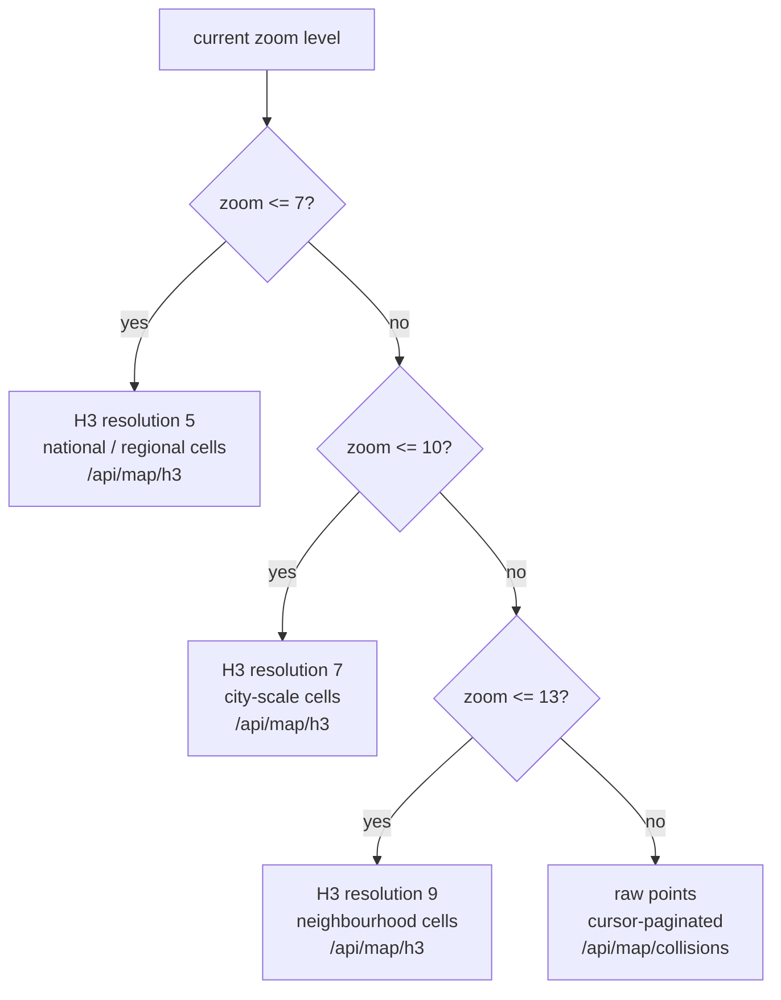

# Map architecture

`/map` is built on [MapLibre GL JS](https://maplibre.org/) for the basemap
and [deck.gl](https://deck.gl/) for data layers, composed via
`react-map-gl/maplibre` and `@deck.gl/react`. `DeckGL` is the parent
component (owns `controller` and `initialViewState`); `Map` is rendered as
its child and deck.gl automatically keeps the two view states in sync, so
panning/zooming the basemap and panning/zooming the data layers never
drift apart.

## Zoom-dependent data source

The map does not fetch and render all ~100k+ collisions per year as raw
points at every zoom level, that would be both slow to query and
unreadable to look at nationally. Instead it switches data source based on
zoom, implemented once in `packages/shared/src/h3-strategy.ts`
(`resolveZoomStrategy`) so the client and the API routes agree on the same
thresholds without duplicating them:

`/api/map/h3` and `/api/map/clusters` both reject requests for a
points-level zoom, and `/api/map/collisions` rejects requests for an
H3-level zoom, enforced server-side via `packages/shared`'s
`H3QuerySchema`/`ClusterQuerySchema`/`CollisionsQuerySchema`, so a client
bug (or a crafted request) can't force a full nationwide raw-point scan.
Raw point queries additionally cap `limit` at
`MAP_QUERY_LIMITS.MAX_RAW_POINT_LIMIT` (5000) and are cursor-paginated
(`collisions/route.ts`, `cursor` param), never offset-paginated, so
performance doesn't degrade on deep pages.

## Layer modes

Nine modes (`packages/shared/src/map-modes.ts`), selected via an accessible
radio group (`components/map/mode-switcher.tsx`):

| Mode | deck.gl layer | Notes |
|---|---|---|
| `HEATMAP` | `HeatmapLayer` (`@deck.gl/aggregation-layers`) | Density visualisation, any zoom. |
| `H3_HEXAGONS` | `H3HexagonLayer` (`@deck.gl/geo-layers`) | Coloured by collision count per cell. |
| `CLUSTERS` | `H3HexagonLayer` | Same data source as hexagons, different styling/interaction. |
| `INDIVIDUAL_COLLISIONS` | `ScatterplotLayer` (`@deck.gl/layers`) | Only available once zoomed to points level. |
| `KSI_ONLY` | Same layer as the current zoom tier | Forces `severity` filter to fatal+serious. |
| `PEDESTRIAN` / `CYCLIST` / `MOTORCYCLIST` | Same layer as the current zoom tier | Forces the corresponding road-user filter. |
| `YOUNG_DRIVER` | Same layer as the current zoom tier | Forces `youngDriverInvolved: true`. |

The mode-specific filters (KSI, pedestrian, and so on) are applied via
`modeForcedParams` in `apps/web/lib/map/build-query.ts`: switching mode
doesn't just restyle the same data, it changes the query. This is why
`e2e/map.spec.ts` clicks through every mode and asserts zero failed API
calls, a forced-filter bug would otherwise only surface as an empty map,
not an error.

## URL-synced state without full navigation

Filters, mode, and viewport are all reflected in the URL query string, so
a `/map?mode=KSI_ONLY&severity=FATAL` link is shareable and the browser
back button works. This is implemented without going through Next.js's
router (which would trigger a full RSC round-trip on every filter tweak,
noticeable lag on a slider or checkbox), instead using
`useSyncExternalStore` (`lib/map/use-map-url-state.ts`) subscribed to
`window.history.replaceState` calls paired with a manually dispatched
`popstate` event, so React re-renders from the URL as the single source of
truth without an extra copy of the same state living in `useState`.

## H3 centroid computation

`h3-js`'s `cellToLatLng` is used both server-side (API routes, to return a
cell's centre point alongside its aggregate count) and client-side (to
compute hexagon boundaries for rendering), rather than only one or the
other, since both the network payload (send an index, not a polygon) and
the rendering layer (which needs actual coordinates) have different needs
from the same H3 index.

## Legend and colour

`/api/map/legend` and `packages/shared/src/severity.ts`'s
`SEVERITY_COLORS` are the single source of truth for the fatal/serious/
slight colour scale (a colourblind-safe red/orange/yellow ramp), used
identically by the legend panel and every data layer, so the legend is
never at risk of drifting from what's actually rendered.

## Tuning

The zoom thresholds (7/10/13) in `resolveZoomStrategy` are documented as
provisional defaults in the source comment. They were chosen to keep
rendered point/hex counts in a readable range at each tier rather than
derived from a formal performance benchmark; if real usage after
deployment suggests a tier switches too early or too late, adjust the
thresholds in `packages/shared/src/h3-strategy.ts` and its test file
together, both the client's layer choice and the API's zoom-level
validation read from the same function.
